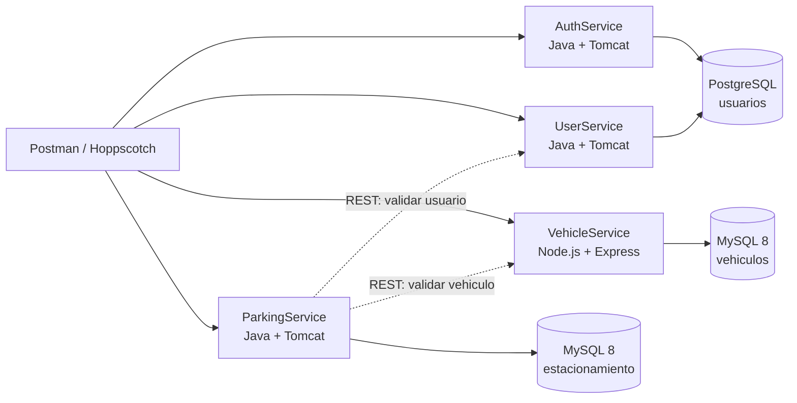
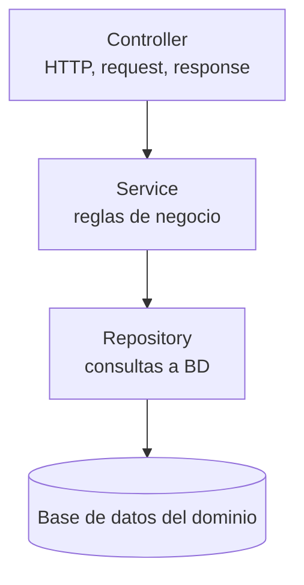

# Arquitectura propuesta

## Vista general

## Separacion por dominio

- Dominio usuarios: AuthService y UserService comparten PostgreSQL del dominio de usuarios.
- Dominio vehiculos: VehicleService usa su propia base MySQL.
- Dominio estacionamiento: ParkingService usa su propia base MySQL.
- No debe haber llaves foraneas entre bases de datos de dominios distintos.

## Capas por microservicio

## Puertos locales sugeridos

- AuthService: `8081`
- UserService: `8082`
- VehicleService: `8083`
- ParkingService: `8084`
- PostgreSQL usuarios: `5432`
- MySQL vehiculos: `3307`
- MySQL estacionamiento: `3308`
- Adminer: `8090`

## Despliegue por servidores segun PDF

Servidor 1:

- AuthService
- UserService
- Base de datos de usuarios

Servidor 2:

- VehicleService
- Base de datos de vehiculos

Servidor 3:

- ParkingService
- Base de datos de estacionamiento

Las plantillas de `deployment/` representan esta distribucion.
